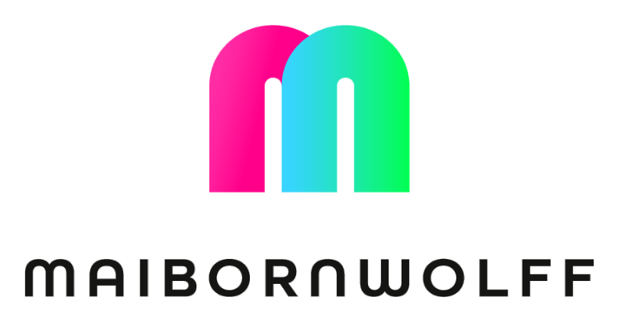
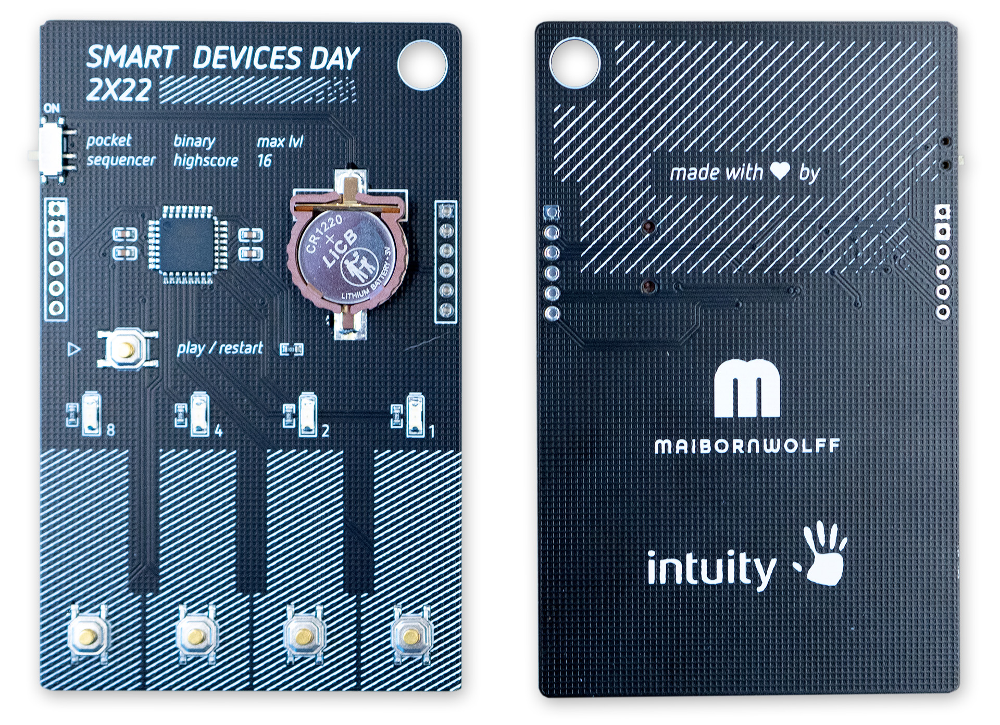
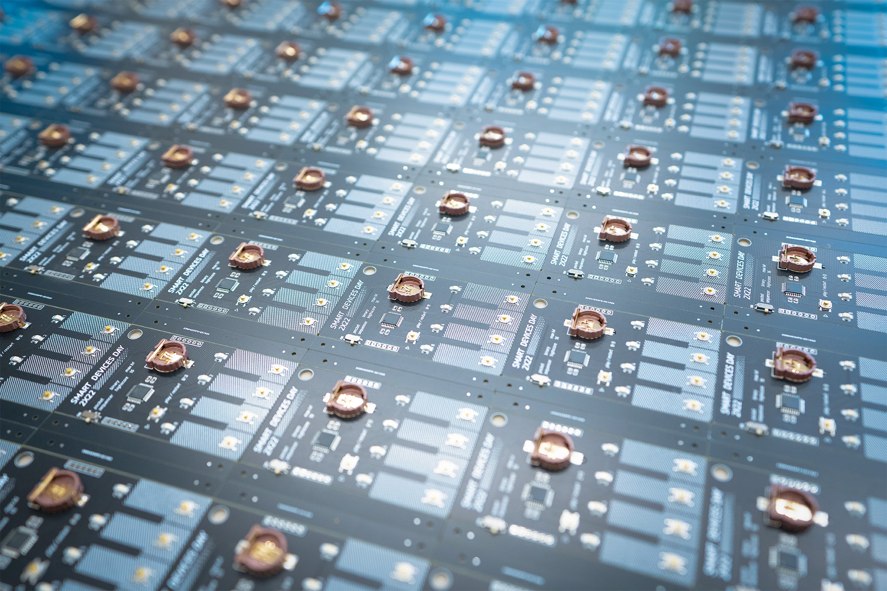

# Smart Devices Day Calling Card

<section style="text-align:center;">
    
    
</section>

This repository documents the collaborative work of [MaibornWolff](https://maibornwolff.de) and [intuity](https://www.intuity.de/) for an ATMEGA based calling card for one of our events.

 

## Features

This calling card holds an implementation of the classic __"Simon Says"__-Memory Game, where you have to remember an increasing sequence of button presses.
The design implements multiple features:
- Allowing for sequences of up to 15, which are suprisingly difficult
- Different animations on the 4 installed LEDs, using the PWM pins of the microcontroller
- Persistend highscore tracking with EEPROM
- Energy saving with smart sleep modes

## Hardware

 

The hardware design is based around the ATMEGA328P and is quite similar to a stripped down version of the Arduino Pro Mini.
We use a small CR1220 battery cell - though we found out that (some) CR1225 batteries also fit the socket and have a little more mAh - to deliver 3V of power to the device, which results in surprisingly long battery lives (greater than an hour of play time).

<!-- TODO schematics -->

## Software

The Software is simple C code created with arduino studio.
We use a custom bootloader to use the internal 8Mhz clock, this saves us one part on the BOM and we do not need the full clock accuracy anyway.
The current code is ~350 lines of code. Most of the lines are being used by functions that improve the overall usability and cover edge cases.
After compilation, the binary uses around ~20% of the available flash memory, so if you have any cool ideas feel free to contribute or create your own firmware!