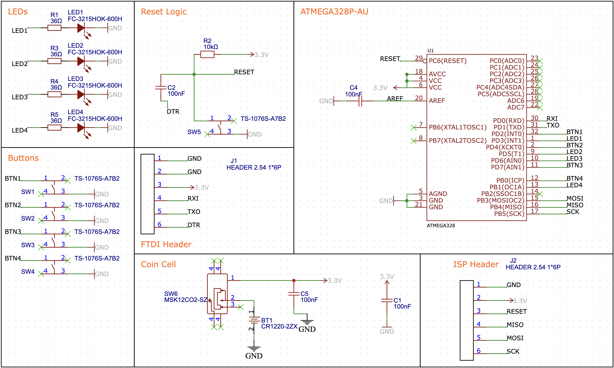

# Smart Devices Day Calling Card

 

<section align="center" style="text-align:center;">
    
      
</section>
  
 
 
  
This repository documents the collaborative work of [MaibornWolff](https://maibornwolff.de) and [intuity](https://www.intuity.de/) for an ATMEGA based calling card for one of our events.

 

## Features

This calling card holds an implementation of the classic __"Simon Says"__-Memory Game, where you have to remember an increasing sequence of button presses.
The design implements multiple features:
- Allowing for sequences of up to 15, which are suprisingly difficult
- Different animations on the 4 installed LEDs, using the PWM pins of the microcontroller
- Persistend highscore tracking with EEPROM
- Energy saving with smart sleep modes

## Hardware

 

The hardware design is based around the ATMEGA328P and is quite similar to a stripped down version of the Arduino Pro Mini.
We use a small CR1220 battery cell - though we found out that (some) CR1225 batteries also fit the socket and have a little more mAh - to deliver 3V of power to the device, which results in surprisingly long battery lives (greater than an hour of play time).

 

## Software

The Software is simple C code created with arduino studio.
We use a custom bootloader to use the internal 8Mhz clock, this saves us one part on the BOM and we do not need the full clock accuracy anyway.
The current code is ~350 lines of code. Most of the lines are being used by functions that improve the overall usability and cover edge cases.
After compilation, the binary uses around ~20% of the available flash memory, so if you have any cool ideas feel free to contribute or create your own firmware!

## How to reprogram

The calling card can be reflashed with a different source code using the Arduino IDE and a FTDI to USB stick. This requires some minor preparation in your IDE setup: 

- Download the "atmega328p_internal_clock_bootloader" from this repository and move it to the Arduino IDE's hardware folder. The path is usually the same for MacOS and Windows: "/Users/YOUR_NAME/Documents/Arduino/hardware/".
- After restarting the IDE, you should find a new entry in your "Board" section called "atmega328p_internal_clock" with one sub-entry called "ATMEGA328 (8 MHz interal clock)".

On the hardware side, we'll be using a FTDI to USB stick ([SparkFun FTDI Basic](https://www.sparkfun.com/products/9873)) on the vertical 6-pin header on the boards left side. You could either solder pins to these, use a 2.54 mm grid pogo-pin clamp or put male jumper wires through these holes while applying a bit of pressure from the side to make good contact.

The connections are (from top to bottom): 

| Calling Card  | FTDI Usb Stick |
| ------------- | ------------- |
| GND  | GND  |
| GND  | CTS  |
| VIN  | 3V3  |
| RX  | TX  |
| TX  | RX  |
| DTR  | DTR  |

To flash new code, simply select the newly installed Board in your IDE, select the FTDI stick's port and upload your code as if it was a stock Arduino board. The programmer remains on the default ("AVRISP mkll").